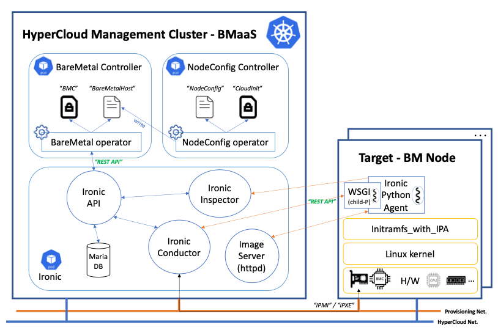

# NodeConfig-Operator

The NodeConfig Operator implements a Kubernetes API for creating linux host config. It creates cloud-init data and also creates a BareMetalHost if it doesn't exist. 

## Guide
- [Installation Guide](./docs/installation.md)
- [Setting up BMC and IPMI Guide](./docs/setting-up-BMC-and-IPMI.md)

## Documents
- [NodeConfig API Documentation](docs/api.md)
- [NodeConfig Operator Workflow](docs/nodeconfig-workflow.md)
- [BMO API Documentation](https://github.com/metal3-io/baremetal-operator/blob/capm3-v0.3.2/docs/api.md)
- [BMO Configuration](https://github.com/metal3-io/baremetal-operator/blob/capm3-v0.3.2/docs/configuration.md)
- [How Ironic works](https://github.com/metal3-io/metal3-docs/blob/master/design/baremetal-operator/how-ironic-works.md)
