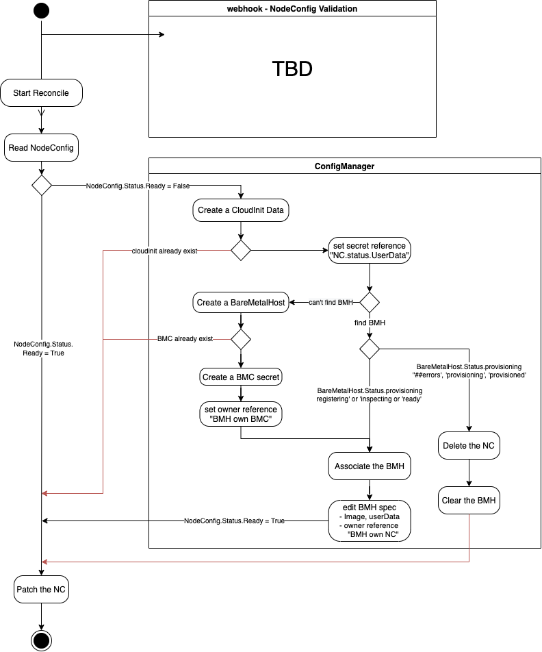

# NodeConfig Operator controlflow - v0.0.3

## scenario #1 
**[정상]** BareMetal Node에 대한 어떠한 CR도 등록되어있지 않은 상태 

1. cloudinit config 생성
2. BareMetalHost 및 BMC-credential 생성
3. BMH에 provisioning에 필요한 NodeConfig 기록
    - 설치할 OS Image
    - UserData (cloudinit)

## scenario #2 
**[정상]** BareMetalHost(BMH) CR이 이미 등록되어있고 사용 가능
* Available BMH condition (provisioning state) - NodeConfig association 가능
  * cready`: node provisioning 시작할 준비가 끝남
  * `registering`: BMC detail 유효성 검사 (통신 가능 여부)
  * `inspecting`: BMC 소켓 통신으로 하드웨어 인벤토리 조사중
  * `match profile`: 하드웨어 인벤토리 유효성 검사

1. cloudinit config 생성
2. NodeConfig에 대응되는 BMH 검색
3. 찾은 BMH에 provisioning에 필요한 NodeConfig 기록
    - 설치할 OS Image
    - UserData (cloudinit)

## scenario #3 
**[실패]** BareMetalHost(BMH) CR이 이미 등록되어있으나 사용 불가

1. cloudinit config 생성
2. NodeConfig에 대응되는 BMH 검색
3. BMH provisioning state가 error이거나 이미 provisioning 시작한 이후일 경우, NC와 BMH 모두 제거

## scenario #4
**[실패]** credential secret들이 이미 만들어져있는 경우

  어떤 작업도 하지 않음
