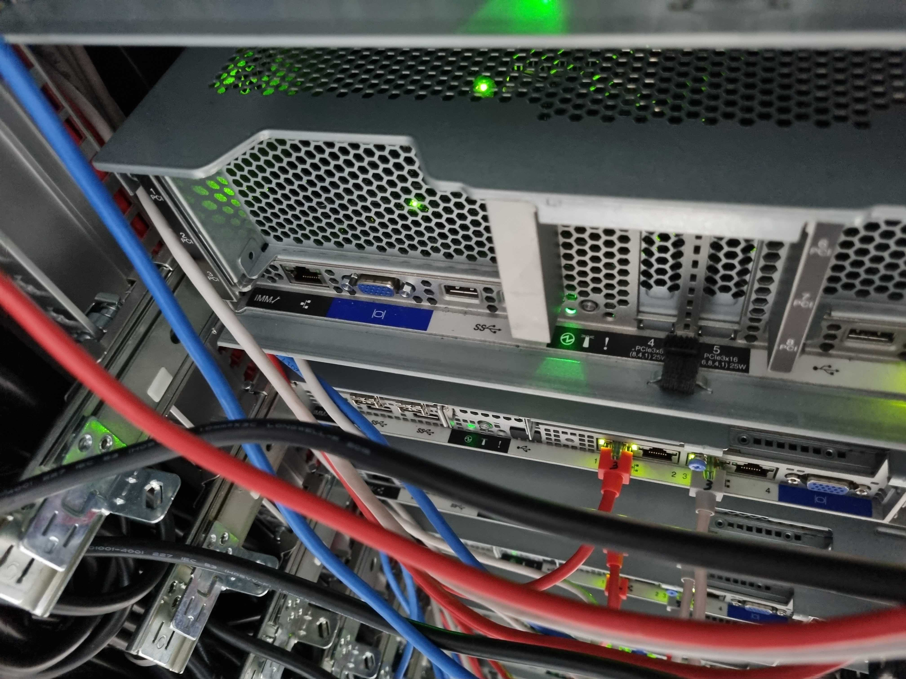

# BMC와 IPMI 설정 가이드

## 설정 가이드
### Step 0. BMC 정보 확인
* 장비에서 BMC 유무 확인 방법
 * 회사마다 장비명은 다름
 * 아래의 사진과 같이 랜선을 꽂는 단자 부분을 확인할시 BMC 사용여부 확인 가능
 * DELL →iDRAC  
   * 
 * IBM → IMM 
   * 
* BMC 정보를 확인하는 command
  ```bash
  $ ipmitool bmc info
  Device ID                 : 32
  Device Revision           : 0
  Firmware Revision         : 5.40
  IPMI Version              : 2.0
  Manufacturer ID           : 19046
  Manufacturer Name         : Unknown (0x4A66)
  Product ID                : 1044 (0x0414)
  Product Name              : Unknown (0x414)
  Device Available          : yes
  Provides Device SDRs      : no
  Additional Device Support :
      Sensor Device
      SDR Repository Device
      SEL Device
      FRU Inventory Device
      IPMB Event Receiver
      IPMB Event Generator
      Chassis Device
  ```

### Step 1. IPMI 설치하기 
* 원격지에 있는 node에 접속하기 위해서는 Bmc와 IPMI 관련 설정이 필요
* ipmitool 설치 
    * 아래의 command를 실행하여 bmc 정보 설정을 위한 준비 
    
    * RHEL/CentOS/Rocky 계열
        ```bash
        $ sudo yum install ipmitool
        or
        $ sudo dnf install ipmitool
        ```

### Step 2. IPMI 정보 확인
* 아래의 command를 활용하여 ipmi 정보를 확인
  ```bash
  $ ipmitool lan print
  Set in Progress         : Set Complete
  Auth Type Support       : NONE MD5 PASSWORD 
  Auth Type Enable        : Callback : 
                          : User     : MD5 PASSWORD 
                          : Operator : MD5 PASSWORD 
                          : Admin    : MD5 PASSWORD 
                          : OEM      : 
  IP Address Source       : Static Address
  IP Address              : 192.168.111.202
  Subnet Mask             : 255.255.255.0
  MAC Address             : 08:94:ef:01:ed:c4
  SNMP Community String   : public
  IP Header               : TTL=0x40 Flags=0x40 Precedence=0x00 TOS=0x10
  BMC ARP Control         : ARP Responses Enabled, Gratuitous ARP Disabled
  Gratituous ARP Intrvl   : 2.0 seconds
  Default Gateway IP      : 192.168.111.1
  Default Gateway MAC     : 00:00:00:00:00:00
  Backup Gateway IP       : 0.0.0.0
  Backup Gateway MAC      : 00:00:00:00:00:00
  802.1q VLAN ID          : Disabled
  802.1q VLAN Priority    : 0
  RMCP+ Cipher Suites     : 1,2,3,4,5,6,7,8,9,10,11,12,13,14,15,16
  Cipher Suite Priv Max   : aaaaaaaaaaaaaaa
                          :     X=Cipher Suite Unused
                          :     c=CALLBACK
                          :     u=USER
                          :     o=OPERATOR
                          :     a=ADMIN
                          :     O=OEM
  Bad Password Threshold  : 0
  Invalid password disable: no
  Attempt Count Reset Int.: 0     
  User Lockout Interval   : 0

  ```

### Step 3. IPMI IP 설정
- ipmitool command를 이용시 IPMI 에 Remote 접근 IP를 설정 가능
    
  ```bash
  $ ipmitool lan set <channel num> ipsrc static
  $ ipmitool lan set <channel num> ipaddr <IPMI Remote IP>
  $ ipmitool lan set <channel num> netmask <IPMI Subnet>
  $ ipmitool lan set <channel num> defgw ipaddr <IPMI Gateway IP>
  $ ipmitool lan set <channel num> access on
  ```
### Step 4. 위와 같이 IP 설정 후 IPMI 를 재시작 

  ```bash
  $ ipmitool bmc reset cold
  ```

### Step 5. IPMI USER 확인
- impmitool command를 활용시 IPMI의 USER를 확인 가능
        
  ```bash
  $ ipmitool user list <channel num>
  ID  Name             Callin  Link Auth  IPMI Msg   Channel Priv Limit
  1                    true    false      false      NO ACCESS
  2   Administrator    true    false      true       ADMINISTRATOR
  3   (Empty User)     true    false      true       NO ACCESS
  4   (Empty User)     true    false      true       NO ACCESS
  5   (Empty User)     true    false      true       NO ACCESS
  6   (Empty User)     true    false      true       NO ACCESS
  7   (Empty User)     true    false      true       NO ACCESS
  8   (Empty User)     true    false      true       NO ACCESS
  9   (Empty User)     true    false      true       NO ACCESS
  10  (Empty User)     true    false      true       NO ACCESS
  11  (Empty User)     true    false      true       NO ACCESS
  12  (Empty User)     true    false      true       NO ACCESS
  13  (Empty User)     true    false      true       NO ACCESS
  ```
### Step 6. IPMI USER 생성
- impmitool command를 활용시 IPMI의 USER의 name 설정
  ```bash
  $ ipmitool user set name <user id> <user name> [<channel num>] 
  ```
- impmitool command를 활용시 IPMI의 USER의 password 설정
  ```bash
  $ ipmitool user set password <user id> [<channel num>] 
  ```
- impmitool command를 활용시 IPMI의 USER의 privilege 부여
  ```bash
  ipmitool user priv <user id> <privilege level> [<channel num>] 
  ```
- privilege level list : Administrator 권한 필요
  ```bash
  Privilege levels:
  * 0x1 - Callback
  * 0x2 - User
  * 0x3 - Operator
  * 0x4 - Administrator
  * 0x5 - OEM Proprietary
  * 0xF - No Access
  ```


